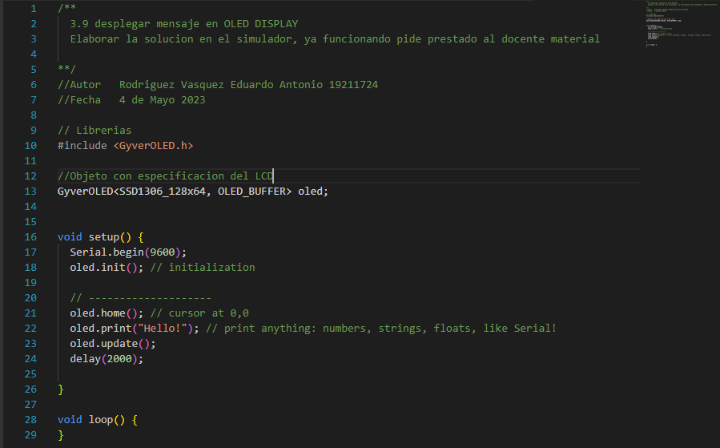
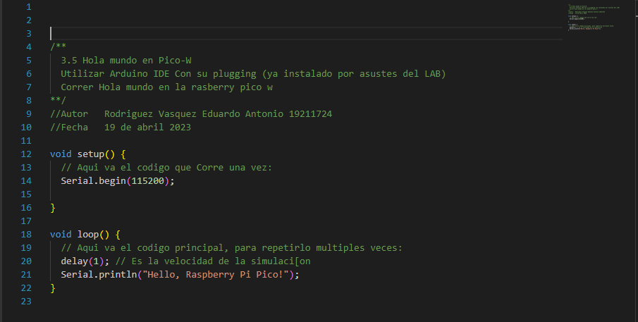

# Practicas-Rasberry-Pico-W

## 3.9 desplegar mensaje en OLED DISPLAY

## 3.8 Embedded Web Server con su PicoW
![3.8 Embedded Web Server con su PicoW] (Servidor.png)

## 3.7 Pico W: Listar los Access Points de Wifi 
![3.7 Pico W: Listar los Access Points de Wifi ] (RedWifiList)

## 3.6 Pico W en físico:LED blink
![3.6 Pico W en físico:LED blink] (BlinkLed.png)

## 3.5 desplegar mensaje en OLED DISPLAY

